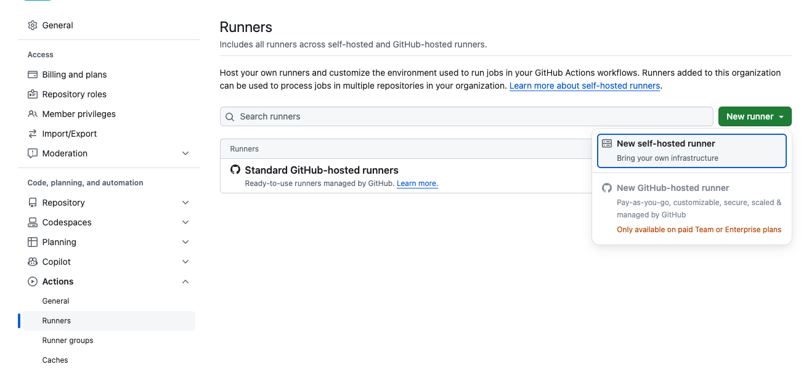

# Github Actions Tips


1. Use Cache to speed up your workflow.
If you use github actions then you probably already using it but if not then add this to your workflow adjusting the path

```yaml
  - name: Cache node modules
      uses: actions/cache@v4
      with:
        # find where dependencies are stored to cache them
        path: ~/.npm  
        # use hash of dependency file(package.json, go.mod, pom.xml) for a key 
        key: ${{ runner.os }}-node-${{ hashFiles('**/package-lock.json') }} 
        # restore-keys will be used when above key not found in cache
        restore-keys: |
          ${{ runner.os }}-node- 
```
Refer to full example [here](https://github.com/DenisPalnitsky/github-actions-hints/blob/main/.github/workflows/cache.yaml)

Grab a specific example for your language from [here](https://github.com/actions/cache?tab=readme-ov-file#implementation-examples)

Behind the scenes, this action packs the content in an archive and sends it to Azure storage. You can browse cache object in Actions->Caches like [here](https://github.com/DenisPalnitsky/github-actions-hints/actions/caches)

2. Create Reusable Actions to avoid yaml duplication.
The custom actions syntax is similar to workflow syntax but with extra metadata and inputs/outputs parameters. Here is a basic example:
```yaml
name: Short sha
description: Provide short git SHA

outputs:
  sha-short:
    description: Short git SHA 
    value: ${{ steps.vars_step.outputs.sha-short }}

runs:
  using: "composite"
  steps:
    - name: Init vars
      shell: bash
      id: vars_step
      
      # here we set the output variable, not printing it as it may seem
      run: |
        echo "::set-output name=sha-short::$(git rev-parse --short=7 HEAD)"  
```
Drop that in `action.yaml` into a repository like [here](https://github.com/DenisPalnitsky/custom-github-action/tree/main). If it's a private repo then make it accessible to other repositories of you org Repository settings -> Actions -> Access -> Accessible from repositories in the Organization.


Ues it in your workflow like this:
```yaml
      - name: Use custom action
        id: custom-action
        # this is our custom action's repository name and branch that we want to use
        uses: denispalnitsky/custom-github-action@main
```
You can find full workflow example [here](https://github.com/DenisPalnitsky/github-actions-hints/blob/main/.github/workflows/custom-action.yaml)

Things to keep in mind:
- you can have only one action per repository so it would make sense to create a repository specifically for action.
- there are multiple ways to create action, the one we reviewed is the simplest one. You can also use [Docker container](https://docs.github.com/en/actions/creating-actions/creating-a-docker-container-action) or [JavaScript](https://docs.github.com/en/actions/creating-actions/creating-a-javascript-action) refer to [official documentation](https://docs.github.com/en/actions/creating-actions) for more details.


3. Self-hosted runners to improve performance and save money 

If your Github Actions bill is growing then getting a self-hosted runners could reduce cost dramatically. Github bills you for the minutes your workflow runs on their runners but when you use your own runners Github does not bill you. You still have to pay for the runner in cloud or on your own hardware though. 
Two other benefits is that you get to choose the machine type that you workflow use and you run the runner on you infrastructure which means it can have access to resources that may not be available outside of your network which is more secure. 

All you need to run a self-hosted runners is to install runner software and run it on a machine that can access Github servers. Go to your organization settings Actions -> Runners -> Add runner and follow the instructions


You can do it on your local machine to test or in the cloud. Self-hosted runners are pretty flexible and you can scale them from one runner to thousands. If you need help with scaling then feel free to reach out to me.

3*. Third-party runners to improve performance and save money without hassle
If you don't want to manage your own runners then there are [plenty](https://medium.com/devops-dev/how-to-reduce-your-github-actions-bill-5e7205879eed) of managed runners available on the market. Refer to a review a did a bit earlier https://medium.com/devops-dev/how-to-reduce-your-github-actions-bill-5e7205879eed


5. Publish images to Github Container Registry to share it with the world 
If you build private images for a specific cloud then you probably will push it to the cloud registry. But if you build images for public use or don't mind pulling them from Github then hosting them on Github Container Registry could be a good idea. 
You will need to login to Github Container Registry and push it. Don't forget github token permissions. 
```yaml
    permissions:
      contents: read
      packages: write
      
    steps:
      - name: Checkout repository
        uses: actions/checkout@v4
            
      - name: Log in to the Container registry
        uses: docker/login-action@v3.2.0
        with:
          registry: ghcr.io
          username: ${{ github.actor }}
          password: ${{ secrets.GITHUB_TOKEN }}

      - name: Build and push Docker image
        id: push
        uses: docker/build-push-action@v5.4.0
        with:
          context: .
          push: true
          tags:  ghcr.io/denispalnitsky/github-actions-tips:latest

```
Further reading on how to add tags and attestations is [here](https://docs.github.com/en/actions/publishing-packages/publishing-docker-images#publishing-images-to-github-packages)


6. Run your workflow locally using [act](https://github.com/nektos/act?tab=readme-ov-file#overview----) 
:note: Although it's not [perfect](https://nektosact.com/not_supported.html) and could be hard to configure for complex workflows, it's still could be useful for debugging. 

    - Install act https://nektosact.com/installation/index.html
    - Try it out with `act push -v`. It could take some time to run the first time as it will pull the build image (3Gb+)
